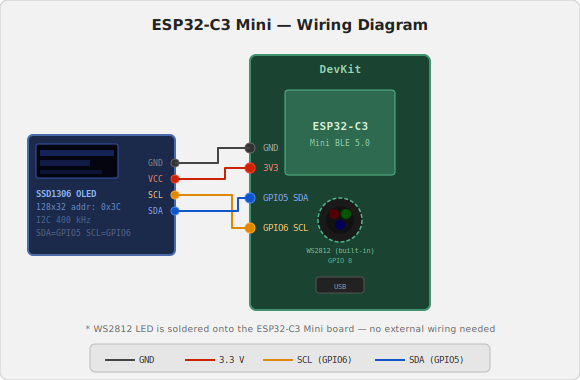

# BLE Server Demo

An ESP32-C3 firmware project built with ESP-IDF. Combines a BLE GATT server, RGB LED control with animations, WiFi captive portal provisioning, NTP time sync, an OLED status display, and a browser-based monitoring/control interface — all running concurrently on a single chip.


## Hardware



| Component | Detail |
|-----------|--------|
| SoC | ESP32-C3 (RISC-V, BLE 5.0, no Classic BT) |
| Flash | 2 MB |
| LED | WS2812 RGB on GPIO 8 |
| OLED | SSD1306 128×32, I2C — SDA GPIO 5, SCL GPIO 6 |

## Features

### BLE GATT Server

Two characteristics under service UUID `0xFF00`:

| UUID | Mode | Description |
|------|------|-------------|
| `0xFF01` | R/W | Persistent string value; cached in RAM, written to NVS on every BLE WRITE |
| `0xFF03` | R/W | LED control command (see below); readable to query current state |

LED feedback in status mode: green = connected, blue flash = read, red flash = write.
Enable/disable BLE advertising at runtime from the web UI.

### LED Control

Accepts commands via BLE (`0xFF03`) or the web UI:

| Command | Effect |
|---------|--------|
| `RRGGBB` | Set static color (6-digit hex, e.g. `FF0080`); brightness-scaled and persisted to NVS |
| `fade` | Smooth HSV hue sweep (~12 s cycle) |
| `rainbow` | Fast hue cycle (~3 s) |
| `fire` | Warm red/orange flicker |
| `off` | Return to BLE status indication mode |

The last set color is restored from NVS on reboot.

### Web Monitor (`http://<device-ip>/`)

Tabbed interface, dark/light theme, mobile-friendly:

- **Demo tab** — RGB sliders with live color preview; one-click animation buttons (Fade/Fire/Rainbow/Off)
- **Log tab** — live BLE event log with timestamps (real time after NTP sync, boot-relative before)
- **Settings tab** — toggle BLE on/off, trigger WiFi credential reset

### WiFi Provisioning (Captive Portal)

When no WiFi credentials are stored, the device opens a SoftAP (`ESP32_XXXXXX`) and presents a captive portal:

- **DNS hijacking** — all domains resolve to `192.168.4.1` (TTL=0, no caching)
- **TCP 443 fast-reject** — RSTs HTTPS probes immediately, reducing Android detection delay from 10+ s to ~1–2 s
- **OS-specific probe handlers** — iOS (`/hotspot-detect.html`), Android (`/generate_204`), Windows NCSI (`/connecttest.txt`)
- WiFi scan with SSID dropdown; remembers last connected network across resets
- Password field with show/hide toggle

### OLED Status Display

128×32 SSD1306 driven over I2C with a custom driver (no external components):

- **3 lines** with gap spacing, rendered via cross-page bit-shifting across the 4 SSD1306 pages
- **Line 0** — BLE device name (static) / "WiFi Setup" during provisioning
- **Line 1** — BLE status: `ADVERTISING` / `CONNECTED` / `DISABLED`
- **Line 2** — WiFi: `Connecting...` → IP address; updated with last BLE op
- Thread-safe: FreeRTOS mutex guards all I2C access from BLE callbacks and WiFi events

### NTP Time Sync

- Syncs on WiFi connect; timezone EST5EDT (configurable in `config.h`)
- Log timestamps switch from boot-relative to real time automatically

## Project Structure

```
main/
  config.h         — all tunable constants (UUIDs, GPIO, OLED, task stacks, log size)
  main.c           — app_main: NVS init, LED init, OLED init, launch BLE + WiFi tasks
  ble_server.c     — GATT server: data characteristic + LED control characteristic
  led_controller.c — WS2812 driver: static color, animations, NVS persistence
  wifi_manager.c   — captive portal provisioning + normal STA connection
  ntp_sync.c       — SNTP client
  web_server.c     — HTTP monitor: tabbed UI, ring-buffer event log, LED control
  oled_display.c   — SSD1306 driver: I2C init, 5×7 font, cross-page line rendering
partitions.csv     — custom partition table (factory 1.875 MB, ~500 KB headroom)
sdkconfig.defaults — enables custom partition table
```

## Build & Flash

Requires [ESP-IDF v5.x](https://docs.espressif.com/projects/esp-idf/en/stable/esp32c3/).

On Windows with the ESP-IDF VS Code extension, use the provided PowerShell script to avoid MSYS environment conflicts:

```powershell
# Build
powershell -ExecutionPolicy Bypass -File .claude/build.ps1 build

# Flash (adjust port as needed)
powershell -ExecutionPolicy Bypass -File .claude/build.ps1 flash -p COM9
```

Or use the ESP-IDF VS Code extension directly (Build / Flash buttons in the status bar).

## Configuration

Edit `main/config.h` before building:

```c
#define BLE_DEVICE_NAME      "ESP32-BLE"   // Advertised BLE name
#define BLE_SERVICE_UUID     0xFF00        // GATT service UUID
#define BLE_CHAR_UUID        0xFF01        // Main data characteristic UUID
#define BLE_LED_CHAR_UUID    0xFF03        // LED control characteristic UUID
#define LED_GPIO             8             // WS2812 data pin
#define LED_BRIGHTNESS       30            // Status mode brightness (0–255)
#define LED_DEMO_BRIGHTNESS  80            // Demo mode max brightness (0–255)
```

## Usage

1. **First boot** — connect to the `ESP32_XXXXXX` WiFi AP, then open `http://192.168.4.1/` (or tap "Configure router" / "Sign in to WiFi" on mobile).
2. Select your network, enter the password, tap **Connect**. The device reboots and connects automatically.
3. Open the web monitor at the device's IP address.
4. Use the **Demo** tab to set LED color or start an animation.
5. Use any BLE client (nRF Connect, LightBlue, etc.) to read/write the GATT characteristics.
6. To change WiFi networks: open **Settings** tab → **Reset WiFi**.
